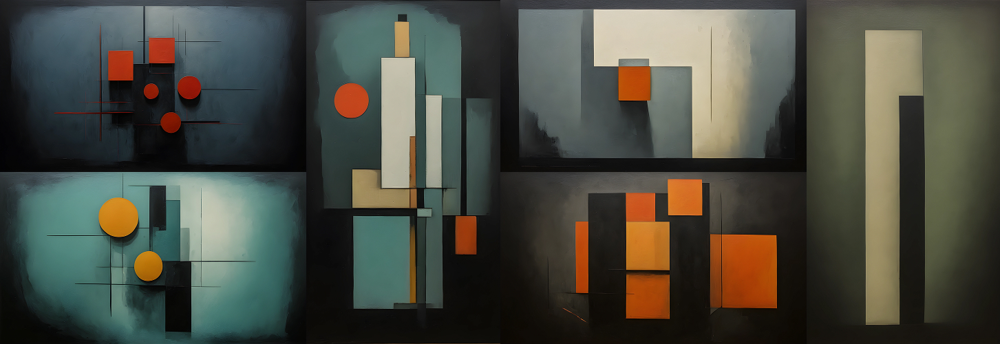

# AI Horde Styles for Ealain

## Style Creation

- AI Horde styles can be made via the API directly or there is [a lite weight style editor courtesy of AI Scribbles](https://www.aiscribbles.com/horde-style-editor/).
- Styles must not have a preset width/height, as ealain will send 1024x576 or 576x1024 as the widthxheight respectively depending on the screen orientation.
- The default Ealain style uses the RealESRGAN_x4plus post-processor to upscale the image to nearly 4k, it is recommended you include an upscaler in your style so images do not look blurry on high resolution displays.
- Ealain sends a single space (`" "`) as the prompt when using a style, be sure to put `{p}` and `{np}` into your style in a place that does not greatly affect your style's generations.

## Style List

### Cubism

`10f702ac-02e8-46ce-b871-3cd8b73726fb`

